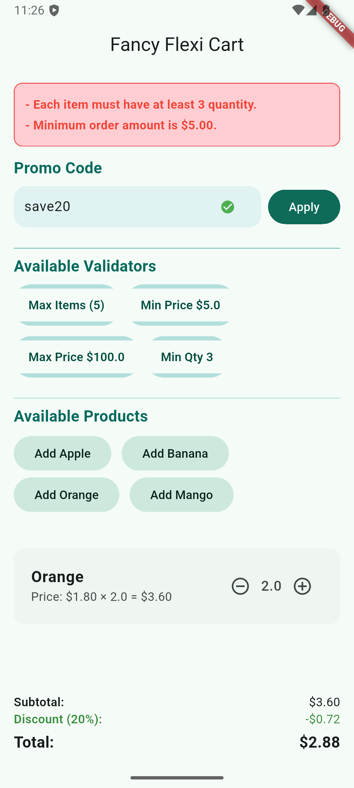

# FlexiCart 🛒

[![pub package][pub_badge]][pub_badge_link] [![License: MIT][license_badge]][license_badge_link]
[](https://codecov.io/gh/supy-io/supy-flutter-packages)


[license_badge]: https://img.shields.io/badge/license-MIT-blue.svg
[license_badge_link]: https://opensource.org/licenses/MIT
[vgv_badge]: https://img.shields.io/badge/style-very_good_analysis-B22C89.svg
[vgv_badge_link]: https://pub.dev/packages/very_good_analysis
[pub_badge]: https://img.shields.io/pub/v/flexi_cart
[pub_badge_link]: https://pub.dartlang.org/packages/flexi_cart

A flexible, feature-rich cart management system for Flutter applications. FlexiCart provides reactive cart management with support for item grouping, quantity control, notes, delivery tracking, and custom business rules.

## Features ✨

- **Item Grouping** - Organize items into logical groups (e.g., by category/vendor)
- **Reactive Architecture** - Built with `ChangeNotifier` for seamless state management
- **Quantity Control** - Precise quantity management with decimal support
- **Custom Input Widget** - Built-in `CartInput` widget with increment/decrement controls
- **Delivery Tracking** - Set and manage delivery dates/times
- **Notes/Comments** - Add cart-level notes
- **Conditional Removal** - Custom rules for item removal
- **Cart Validation** - Comprehensive validation system with custom validators and promo codes
- **Type Safety** - Generic implementation for any item type
- **Deep Copying** - Clone cart instances with complete state
- **Mixins Support** - Prevent disposed state notifications
- **Lock/unlock** cart for safe operations
- **Cart expiration** support set expired duration
- **Stream-based** state emission
- **Plugin architecture** for extending behavior
- **Internal logging** for debugging
- **Exchange Rate Support** for converting item prices

## Installation 📦

Add to your `pubspec.yaml`:

```yaml
dependencies:
   flexi_cart: latest
   provider: ^6.0.0 
```

## Documentation 📖

- **[Validator Guide](guides/flexi_cart_validator_guide.md)** - Complete guide for cart validation, custom validators, and promo code validation

## Screenshots 📸

<div style="display: flex; gap: 10px;">

  

  
  

  
  
  
  

</div>

## 🚀 Getting Started
### Basic Setup

- #### Create Cart Instance
```dart
Provider(create: (_) => FlexiCart(...))

/// Initialize the cart:
final cart = FlexiCart();
```

- #### Define your item model
  Your model must implement the ICartItem interface.
```dart
class ProductItem extends ICartItem {
   // implement required properties like id, name, quantity, etc.
}

final product = ProductItem(...)
```
- #### Use CartInput Widget
```dart
final product = ProductItem(...);

// Add to cart
context.read<FlexiCart>().add(product);

// Use in UI
CartInput(
  item: product,
  decimalDigits: 2,
  maxQuantity: 100,
  onChanged: (updatedItem) {
  print("Quantity updated: ${updatedItem.quantity}");
  },
);

```
### Basic Operations
- #### Initalize a cart item object and add it to cart
```dart
final product = ProductItem(
   id: '123',
   name: 'Widget Pro',
   price: 29.99,
);
context.read<FlexiCart>().add(product);
```
- #### Remove item from cart if existed

```dart
cart.delete(product);
```
- #### Get Total Calculation:

```dart
double total = cart.totalPrice();
int itemCount = cart.totalQuantity();
```

- #### Stream: Listen to cart changes reactively
```dart
cart.stream.listen((updatedCart) {
  print('Cart updated: ${updatedCart.items.length} items');
});
```
- #### Lock the cart to prevent changes
```dart
cart.lock();
try {
  cart.add(MockItem(id: '1', name: 'Apple', price: 2.0));
} catch (e) {
  print('Error: $e'); // Cart is locked.
}
cart.unlock(); // Now it's safe to mutate
```

- #### Set Metadata Entry
```dart
cart.setMetadataEntry('couponCode', 'SUMMER25');
cart.setMetadataEntry('sessionId', 'abc-123');
print(cart.metadata['couponCode']); // SUMMER25
```

> 📋 **For comprehensive validation documentation**, see the [Validator Guide](guides/flexi_cart_validator_guide.md)

- #### Currency Exchange Feature
```dart
final cart=context.read<FlexiCart>();
final currency = CartCurrency(code: 'EUR', rate: 1.2);
cart.applyExchangeRate(currency);

// ... later
cart.removeExchangeRate();
```
- ```applyExchangeRate()``` multiplies item prices and updates internal cart currency.

- ```removeExchangeRate()``` restores original prices by dividing using the last applied rate.

- #### Set expiration
```dart
cart.setExpiration(Duration(minutes: 30));
print(cart.isExpired);
```
- #### Logs
```dart
print(cart.logs); // View history of cart changes
```
- #### Register plugin
```dart
cart.registerPlugin(PrintPlugin());

class PrintPlugin extends ICartPlugin<MockItem> {
  @override
  void onChange(FlexiCart<MockItem> cart) {
  print('Cart changed via plugin: ${cart.totalQuantity()} items');
  }
}
```
- ####  CartDiff To track item changes between states:
```dart
final old = {...cart.items}; // snapshot
cart.add(newItem);
final diff = calculateCartDiff(old, cart.items);
print(diff.added); // List of added items
```

## 📚 API Reference

### FlexiCart Class

| Method                | Description                      |
| --------------------- | -------------------------------- |
| `add(item)`           | Add or update an item            |
| `addItems(list)`      | Add multiple items               |
| `delete(item)`        | Remove an item                   |
| `reset()`             | Clear the cart                   |
| `totalPrice()`        | Total price of items             |
| `totalQuantity()`     | Total quantity of items          |
| `getItemsGroup(id)`   | Get grouped items                |
| `clearItemsGroup(id)` | Remove items from a group        |
| `clone()`             | Deep clone of the cart           |
| `cast<G>()`           | Cast cart to another item type   |
| `isNotEmpty()`        | Returns `true` if cart has items |
| `isEmpty()`           | Returns `true` if cart is empty  |
| `setNote()`           | Add or change cart note          |
| `setDeliveredAt()`    | Set delivery date/time           |
| `lock()`              | Lock Cart                        |
| `unlock()`            | unLock Cart                      |
| `registerPlugin()`    | Register Plugin to cart          |
| `setExpiration()`     | Set an Expiration date           |
| `logs`                | Get Logs History                 |
| `applyExchangeRate()` | multiplies item prices and updates internal cart currency. |
| `removeExchangeRate()` | restores original prices by dividing using the last applied rate |
| `validate()`          | Validate cart and return errors  |
| `addValidator()`      | Add custom validator function    |
| `setPromoCode()`      | Set promotional code             |

### CartInput Widget

| Property        | Description                                   |
|-----------------|-----------------------------------------------|
| `item`          | Required cart item instance                   |
| `decimalDigits` | Number of decimal places (0–6)                |
| `maxQuantity`   | Maximum allowed quantity                      |
| `hideButtons`   | Hide +/- buttons (default: `false`)           |
| `showZeroQty`   | Display 0 instead of empty (default: `false`) |
| `axis`          | Set Axis of the Widget                        |

## Advanced Guides 📖

- **[Cart Validation Guide](guides/flexi_cart_validator_guide.md)** - Learn how to implement custom validators, promo code validation, and automatic validation

## 🙌 Contributions
Feel free to fork, contribute, or suggest features. PRs are welcome!
